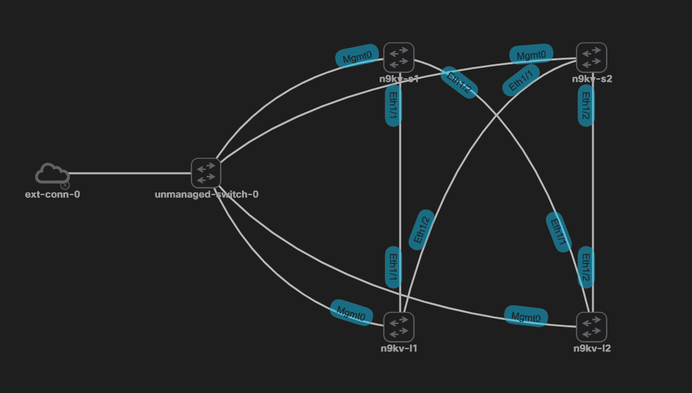

# VXLAN_Fabric_Deploy

The VXLAN fabric deployment playbooks assist in helping engineers rapidly deploy a VXLAN Fabric using CML.  The playbook currently deploys two spine and leaf switches that are fully operational after running the playbook.  After running the initialize_vxlan_fabric, VNIs can be added to test VXLAN L2 connectivity between devices.

## Limitations:

- No support for ISIS, yet.
- Code is fairly rigid
  -  Expanding to more nodes today requires editing the role playbooks for spine and leaf with your additional interfaces.  Would like to increase flexibility.

## Setup:

At a minimum, the playbooks require at you have SSH connectivity to your devices.  This guide assumes you are running CML version 2.  To run the playbooks **as-is** your fabric should look similar to the image below.  The external connector needs to be configured for **"bridge"** mode.  An unmanaged switch (or managed if you desire) should be used to connect the external connector and management interfaces of the spine and leaf switches.  Finally make the following connections between switches:

- Spine 1 (Eth1/1 and Eth1/2) to Leaf 1 (Eth 1/1) and Leaf 2 (Eth 1/1)
- Spine 2 (Eth1/1 and Eth1/2) to Leaf 1 (Eth 1/2) and Leaf 2 (Eth 1/2)



Use IP addresses that you are able to assign to CML and are accessible from your Ansible server.  Assign the addresses to the management interfaces of each device.  Document what IP you assign to each device as these will be needed in the inventory.yml file to identify the correct switch.

```
vrf context management
  ip route 0.0.0.0/0 X.X.X.X
interface mgmt0
  vrf member management
  ip address X.X.X.X/YY
```

Validate you can reach each device via SSH before proceeding.

## Directions

Playbooks should be run in this order:

- generate_day1_config.yml
- hardware_tcam_settings.yml
- initialize_vxlan_fabric.yml
- add_vni.yml

The generate_day1_config.yml playbook takes the existing configuration of the devices and creates a day-one.config file on the bootflash:/ of the switches.  The step enables you to revert back to your initial configuration (basic authentication and mgmt access) and re-run the scripts again from scratch.

The hardware_tcam_settings.yml playbook adjusts TCAM space to enable ARP supression capability.  ARP suppression functionality requires that ARP-ETHER TCAM has space added to it.  For this example we zero out vpc-convergence and add the space to arp-ether.  The box will then reboot to apply changes.

The initialize_vxlan_fabric.yml playbook deploys the fabric.  The playbook calls out three sections:

- common
  - This runs tasks in ./roles/common/tasks/main.yml and sets basic information up like domain name, banner, and features.  This is meant to deploy common elements on all devices.
- spine
  - This runs tasks in ./roles/spine/tasks/main.yml and configures the components necessary to configure the spine switches.
- leaf
  - This runs tasks in ./roles/leaf/tasks/main.yml and configures the components necessary to configure the leaf switches.
 
When initialize_vxlan_fabric is complete the system is ready for a VNI to be deployed.  The add_vni.yml playbook can be editted or ran as is to deploy an L2VNI on the leaf switches.  Once completed, you'll need to add hosts off each leaf switch and test connectivity.  You will need to configure the leaf port you connect each host to in the VLAN you assigned for VXLAN (in this example the vlan is 50).  For my test I used the CMLv2 **Desktop** node which runs Alpine Linux.  I configured each device with an IP in the same subnet and performed a simple ping test.

## Verification

Basic verification that everything is operating will be a ping between devices is successful.  Additional verification steps are as follows:

- Verify underlay routing:
  - show ip route
  - *From leaf 1 ping leaf 2*, show ip route 10.168.0.12 ,*Verify two paths exist through Eth1/1 and Eth1/2*
  - *From leaf 2 ping leaf 2*,  show ip route 10.168.0.11 ,*Verify two paths exist through Eth1/1 and Eth1/2*
  - *Verify leaf 1 can ping leaf 2*, ping 10.168.0.12 source-interface loopback2
  - *Verify leaf 2 can ping leaf 1*, ping 10.168.0.11 source-interface loopback2
- Verify overlay routing:
  - show ip bgp summary
- Verify VXLAN operation:
  - show vxlan
  - show nve peers ,*Only works when traffic has been generated from hosts associated with VLAN/VXLAN*
  - sho bgp l2vpn evpn
  - sho bgp l2vpn evpn vni-id 100500

